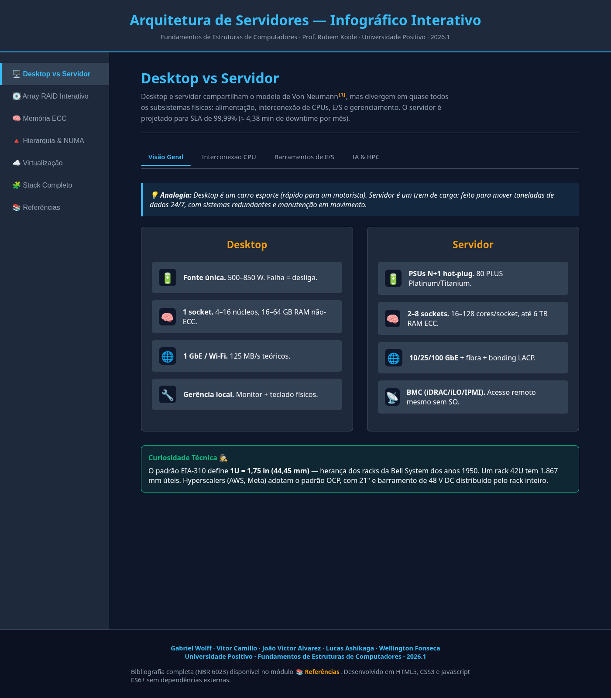

<!-- _class: lead -->
<!-- _paginate: false -->

# Arquitetura de Servidores

## Infográfico Interativo

**Gabriel Wolff** · **Vitor Camillo** · **João Victor Alvarez**
**Lucas Ashikaga** · **Wellington Fonseca**

Fundamentos de Estruturas de Computadores
Prof. Rubem Koide · Universidade Positivo · 2026.1

<!--
NOTAS — Gabriel — 30 segundos

Boa noite, professor Koide. Boa noite, turma.

Eu sou o Gabriel Wolff e junto comigo estão o Vitor, o João Victor, o Lucas e o Wellington. Nós vamos apresentar o projeto final da disciplina: um infográfico interativo sobre arquitetura de servidores.

Em 15 minutos vamos passar por seis módulos do projeto. Eu começo com a abertura e o módulo um, depois cada colega apresenta o módulo que dominou. No final voltamos para uma conclusão rápida e abrimos pra perguntas.

Pode passar pro próximo slide.
-->

---

## Por que esse projeto?

> "Servidor é só um computador maior, né?"

Essa é a impressão de quem nunca abriu um datacenter.

**Na verdade**, servidor é um conjunto de subsistemas projetados pra **nunca parar**:

- Fontes de energia **duplicadas** (uma queima, outra assume)
- Memória que **detecta e corrige erros invisíveis**
- Discos em **rede redundante** (quebra um, dados ficam intactos)
- Acesso remoto **mesmo com o sistema operacional travado**

Nosso projeto mostra **por que** e **como** cada uma dessas peças existe.

<!--
NOTAS — Gabriel — 1 minuto

A maioria das pessoas — inclusive estudantes de computação — acham que servidor é só "um PC maior". Não é. Servidor é uma máquina projetada com uma obsessão única: nunca, jamais, em hipótese alguma, ficar fora do ar.

Pensa comigo: a Amazon faturou bilhões em uma Black Friday. Se o servidor cair por dez minutos, o prejuízo é incalculável. Por isso tudo no servidor é redundante. Tem duas fontes de energia — se uma queima, a outra assume sem desligar a máquina. A memória RAM tem um chip extra que detecta erros causados por raio cósmico, sim, raio cósmico, e corrige eles automaticamente. Os discos ficam em formação especial chamada RAID — se um quebra, os dados continuam intactos nos outros. E ainda tem um chip dedicado, separado do processador principal, que permite ligar e desligar o servidor remotamente, mesmo se o Windows ou Linux travar completamente.

A primeira versão do nosso projeto, em abril, mostrou esses conceitos só com analogias e curiosidades. O professor Koide foi direto: faltou profundidade. Esta segunda versão é a resposta a essa crítica — agora tem tabelas com números reais, fórmulas matemáticas, especificações de processadores que existem de verdade, e uma bibliografia formal com 17 referências, incluindo Hamming de 1950 e Amdahl de 1967.

Próximo slide.
-->

---

## Como o infográfico funciona

**Um único arquivo HTML**, sem internet, sem instalação.

Abre no navegador → 6 módulos interativos:

1. Desktop vs Servidor
2. RAID (proteção de disco)
3. Memória ECC (detecção de erro)
4. Hierarquia de memória + NUMA
5. Virtualização
6. Stack completo (síntese)

Mais: **módulo de referências clicáveis** (ABNT).

<!--
NOTAS — Gabriel — 30 a 45 segundos

Antes de entrar nos módulos, uma palavra sobre como ele foi construído. O infográfico é um único arquivo HTML, dois mil quinhentos linhas. Não tem dependência externa, não usa framework, não precisa de internet. Você abre o arquivo no navegador e funciona.

Essa decisão foi proposital. O foco era arquitetura de computadores, não engenharia de front-end. E como entregável, é simples: a banca recebe o arquivo, dá dois cliques, e está apresentando.

Na barra lateral à esquerda temos seis módulos temáticos mais um sétimo item com a bibliografia completa, em formato ABNT, onde toda citação dentro dos módulos é clicável e leva direto pra entrada correspondente.

Vou abrir aqui no navegador pra demonstrar ao vivo. A partir de agora, alternamos entre o slide e o navegador.

Passa o microfone pro próximo.
-->

---

# Módulo 1 — Desktop vs Servidor

### A analogia: carro esporte vs trem de carga

| O que tem o desktop... | ...e o que tem o servidor |
|---|---|
| 1 fonte de energia | 2 fontes (uma sobrando) |
| 1 processador | até 8 processadores físicos |
| 16 a 64 GB de RAM | até 6 **mil** GB de RAM |
| Wi-Fi ou cabo 1 Gigabit | fibra óptica 10 a 100 Gigabit |
| Você precisa **estar lá** pra ligar | Liga **remotamente** mesmo travado |

> O servidor tem que ficar **99,99%** do tempo ligado.
> Isso é só **4 minutos de downtime por mês**.

<!--
NOTAS — Gabriel — 2 minutos

Vou ficar com o módulo 1 que é o introdutório.

A melhor analogia que encontramos: desktop é um carro esporte. É rápido, confortável pro motorista, foi projetado pra uma pessoa usar. Servidor é um trem de carga. É feito pra carregar toneladas de informação vinte e quatro horas por dia, sete dias por semana, sem parar, com sistemas redundantes pra caso algo dê errado.

Vejam a tabela: o desktop tem uma fonte de energia. Se queimar, o computador desliga e pronto. O servidor tem duas fontes funcionando ao mesmo tempo. Se uma queima, a outra assume sozinha sem ninguém perceber. A gente chama isso de hot-plug, troca a quente: o técnico pode até tirar a fonte queimada e colocar uma nova com o servidor ligado.

O desktop tem um processador físico. O servidor pode ter dois, quatro, ou oito processadores físicos compartilhando uma única memória RAM gigante, que pode chegar a seis mil gigabytes — isso é seis terabytes de RAM. O meu notebook tem dez gigabytes. Um servidor tem seiscentas vezes mais.

A rede do desktop é Wi-Fi ou cabo de um gigabit por segundo. A do servidor é fibra óptica e pode chegar a cem gigabits — cem vezes mais rápido. E como você liga um servidor que ficou sem sistema operacional? Tem um chip dedicado, chamado iDRAC na Dell ou iLO na HP, que tem o próprio endereço IP, independente do servidor. Você acessa pelo navegador e liga, desliga, atualiza a BIOS, vê a tela como se estivesse na frente da máquina. Tudo isso remotamente.

Por que tanta redundância? Porque o servidor tem que ficar noventa e nove vírgula noventa e nove por cento do tempo ligado. Esse é o famoso "quatro noves" do mercado. Parece muito? Faz a conta: noventa e nove vírgula noventa e nove por cento de um mês equivale a apenas quatro minutos parado. Quatro minutos por mês inteiro. Por isso tudo precisa ter backup.

Passo pro Vitor que vai apresentar o RAID.
-->

---

# Módulo 2 — RAID: protegendo os dados

| Nível | O que faz | Sobrevive a... |
|---|---|---|
| **RAID 0** | Divide o arquivo entre discos (velocidade) | nenhuma falha |
| **RAID 1** | Cópia idêntica em 2 discos (espelho) | 1 disco quebrado |
| **RAID 5** | Espalha dados + paridade matemática | 1 disco quebrado |
| **RAID 10** | Espelha **e** divide (melhor dos 2 mundos) | 1 disco por par |

### Como o RAID 5 reconstrói? Matemática simples.

> **C = A ⊕ B ⊕ P**  *(XOR — o operador lógico básico)*
> Se o disco com `C` morre, o sistema calcula `C` usando os outros.

<!--
NOTAS — Vitor — 2 minutos

Bom, depois da abertura do Gabriel, eu sou o Vitor e vou falar do segundo módulo, que é sobre RAID.

RAID é a sigla de Redundant Array of Independent Disks, em português, conjunto redundante de discos independentes. A ideia é simples: em vez de usar um disco só, você combina vários pra ganhar velocidade, proteção, ou os dois ao mesmo tempo.

Existem vários níveis, mas os principais são esses quatro.

RAID 0: dois discos guardando metades diferentes do mesmo arquivo. Como duas pessoas escrevendo metades de um documento ao mesmo tempo — fica pronto na metade do tempo. Muito rápido. Mas se um sumir, o documento perde sentido. Zero proteção.

RAID 1: dois discos com cópias idênticas, como tirar Xerox de cada documento. Se molhar o original, você tem a cópia. Mas você precisa de duas vezes mais espaço, porque metade está duplicada.

RAID 5: o pulo do gato. Espalha os dados entre três discos e em cada bloco guarda um número mágico chamado paridade. Esse número é calculado fazendo uma operação lógica chamada XOR — é como uma equação matemática. Se um disco morre, o sistema usa a fórmula inversa para reconstruir os dados perdidos em tempo real. É como saber que dois mais três é cinco: se você esquece o três, ainda sabe que cinco menos dois dá três. O sistema faz isso bit a bit.

RAID 10 combina tudo: cria pares espelhados como RAID 1 e divide os dados entre os pares como RAID 0. É o padrão pra banco de dados de empresas grandes — Itaú, Bradesco, Nubank usam RAID 10 nos sistemas críticos.

Agora, no infográfico tem um simulador onde dá pra clicar nos discos e simular falhas. Vou abrir aqui. Olha, RAID 5, clico no disco um, vai pra estado degradado, ainda funcionando. Mas se eu clicar no segundo, aí sim perde tudo, porque RAID 5 só sobrevive a uma falha.

E tem ainda uma calculadora que estima quantos IOPS — operações por segundo — cada configuração consegue. E uma demonstração matemática da Lei de Amdahl, de 1967, que prova que não adianta paralelizar tudo: se 99 por cento do tempo do seu programa é serial, ter mil discos em paralelo te dá ganho de só 1 vírgula 01 vezes. A lição: otimize a parte serial primeiro.

Passo pro João Victor, que vai falar da memória.
-->

---

# Módulo 3 — Memória ECC: erros invisíveis

### Raios cósmicos **invertem bits** da sua RAM. Sério.

Partículas atravessam a atmosfera → atingem o chip → mudam um **0 pra 1** (ou o contrário).

|  | RAM comum (desktop) | RAM ECC (servidor) |
|---|---|---|
| Resposta a 1 bit-flip | 🔴 trava / tela azul | 🟢 **detecta e corrige sozinho** |
| Como? | — | chip extra + código **Hamming (1950)** |
| Recalcula paridade | — | em cada leitura |

> **Estudo Google:** &gt;8% dos pentes de RAM têm ≥ 1 erro corrigível **por ano**.

<!--
NOTAS — João Victor — 2 minutos

Sou o João Victor e vou falar do módulo de memória ECC, que provavelmente é o conceito mais bizarro pra quem nunca ouviu falar.

Vou começar pelo que parece teoria de conspiração mas não é: raios cósmicos podem inverter bits da sua memória RAM. Não estou inventando. Partículas subatômicas, principalmente nêutrons, atravessam a atmosfera, atingem o chip de memória, ionizam um pedacinho de silício e mudam um zero pra um, ou um um pra zero. Aleatoriamente. Em qualquer momento.

No seu desktop normal, sem proteção, o que acontece quando isso ocorre? Depende. Pode ser inofensivo, se foi num bit que ninguém usou. Pode crashar o programa. Pode crashar o sistema operacional inteiro — a tela azul da morte no Windows ou kernel panic no Linux. Pode pior: o programa continua funcionando, mas com dado corrompido, e você nem percebe.

Por isso servidores usam memória ECC, sigla pra Error Correcting Code. Em vez de ter oito chips no pente, tem nove: o chip extra guarda bits de paridade calculados por uma técnica matemática chamada código de Hamming, inventada em 1950 pelo Richard Hamming, ainda nos laboratórios da Bell Telephone.

Quando o servidor lê a memória, ele recalcula a paridade. Se o número bate, o dado está íntegro. Se não bate, o sistema sabe que algum bit virou, descobre exatamente em qual posição ele está usando matemática, inverte ele de volta, e entrega o dado correto pro programa. Tudo isso em nanossegundos, sem o sistema operacional nem ficar sabendo.

E quão comum é isso? O Google fez um estudo enorme em 2009 com a frota deles. Resultado: mais de oito por cento dos pentes de memória do mundo apresentam pelo menos um erro corrigível por ano. E os erros não vêm só de raio cósmico — vêm de envelhecimento, de contaminação na solda. Por isso todo servidor sério usa memória ECC. Sem ela, o servidor travaria a cada dois ou três meses sem motivo aparente.

Tem um caso famoso: eleição na Bélgica em 2003, uma candidata recebeu quatro mil e noventa e seis votos extras. Por quê? Bit flipou na posição treze do contador, e dois elevado a doze é exatamente quatro mil e noventa e seis. Sistema sem ECC.

Passo pro Lucas, que vai falar da hierarquia de memória.
-->

---

# Módulo 4 — Hierarquia de memória

### A CPU é tão rápida que **esperar a RAM já é "lento"**

Por isso existe cache. Imagine que 1 ciclo de CPU = 1 segundo:

| Onde está | Tamanho | Quanto demora | "Em segundos" |
|---|---|---|---|
| **Cache L1** (dentro da CPU) | 32 KB | 1 nanossegundo | 3 segundos |
| **Cache L3** (compartilhado) | 20 MB | 12 nanossegundos | 40 segundos |
| **RAM** (local) | 256 GB | 80 nanossegundos | 4 minutos |
| **SSD NVMe** | 4 TB | 50 microssegundos | 2 dias |
| **HDD mecânico** | 20 TB | 10 milissegundos | **1 ano** |

<!--
NOTAS — Lucas — 2 minutos

Bom dia, sou o Lucas e vou explicar a hierarquia de memória, que é o módulo quatro.

Pergunta inicial: por que diabos existe cache? A resposta curta: porque a CPU é absurdamente rápida e a RAM, comparada a ela, é lenta demais.

Pra vocês terem ideia: uma CPU moderna roda a três gigahertz, ou seja, faz três bilhões de operações por segundo. Cada operação leva um terço de nanossegundo. Já um acesso à RAM leva oitenta nanossegundos. Pra CPU é uma eternidade — ela ficaria parada esperando, sem fazer nada útil.

A solução foi colocar memórias menores, mas absurdamente rápidas, dentro do próprio chip da CPU. Essas memórias se chamam cache, e tem três níveis: L1, L2 e L3. L1 é a mais próxima dos núcleos, tem 32 kilobytes, e responde em 1 nanossegundo. L3 é compartilhada entre todos os núcleos, tem 20 megabytes, e responde em 12 nanossegundos.

Pra vocês sentirem a diferença de escala, fiz essa tabela hipotética: imaginem que um ciclo da CPU dura um segundo. Nessa escala, ler do cache L1 levaria três segundos. Da RAM, levaria quatro minutos. Do SSD, dois dias. Do HD mecânico, um ano inteiro. Por isso a CPU trabalha em equipe com as caches: noventa e dois por cento dos acessos de programa típico nunca precisam descer até a RAM, ficam resolvidos no cache.

E mais uma coisa fascinante: em servidores com vários processadores físicos, surge um problema chamado NUMA, Non-Uniform Memory Access, acesso não-uniforme à memória. Cada processador tem sua memória local. Acessar a própria memória é rápido. Acessar a memória do processador vizinho passa por um cabo entre eles e custa quase o dobro. O sistema operacional tem que ser esperto pra colocar as tarefas perto da memória que elas usam, senão a performance afunda.

Passo pro Wellington, que vai falar de virtualização.
-->

---

# Módulo 5 — Virtualização

### "1 servidor físico → dezenas de máquinas virtuais"

Antes era 1 servidor rodando 1 sistema — **80% ocioso**. Hoje, o **hypervisor** fatia o hardware em VMs independentes.

|  | **Tipo 1** (bare metal) | **Tipo 2** (hosted) | **Container** |
|---|---|---|---|
| Roda sobre | hardware direto | um SO normal | kernel do host |
| Exemplos | ESXi, KVM, Hyper-V | VirtualBox, Workstation | Docker, K8s |
| Boot | ~30s | ~30s | **~100ms** |
| Densidade | ~50/host | ~10/host | **~2.000/host** |
| Onde | datacenter | dev / lab | nuvem moderna |

<!--
NOTAS — Wellington — 2 minutos

Sou o Wellington, último apresentador antes da conclusão. Vou falar de virtualização.

Antigamente — e por "antigamente" eu quero dizer anos 2000 — cada servidor físico rodava um único sistema operacional. Resultado: na média, o servidor ficava oitenta por cento ocioso. Era um desperdício enorme. Empresas tinham salas inteiras de servidores que mal usavam.

A solução foi a virtualização. Um software especial, chamado hypervisor, divide o servidor físico em várias máquinas virtuais, ou VMs. Cada VM se comporta como se fosse um computador inteiro independente: tem seu processador virtual, sua memória virtual, seu disco virtual, e roda seu próprio sistema operacional. Um servidor físico pode rodar tranquilamente cinquenta VMs ao mesmo tempo.

Tem dois tipos de hypervisor. O Tipo 1, chamado bare metal, é instalado diretamente no hardware, sem Windows ou Linux por baixo. O hypervisor é o próprio sistema operacional. Exemplos: VMware ESXi, KVM no Linux, Hyper-V da Microsoft. É o que se usa em datacenters de verdade. O Tipo 2 roda em cima de um sistema operacional comum — é o VirtualBox que muito de vocês já usaram pra testar Linux dentro do Windows. Mais lento, porque tem o overhead do sistema hospedeiro, mas suficiente pra desenvolvimento e laboratório.

Mais recente ainda: containers. Ao invés de criar uma máquina virtual completa com seu próprio kernel, o container reusa o kernel do servidor host e só isola o que está rodando em cima. É absurdamente mais leve. Uma VM demora trinta segundos pra subir e ocupa gigabytes. Um container sobe em cem milissegundos e ocupa megabytes. Por isso a Amazon, Azure e Google Cloud conseguem rodar milhões de aplicações em paralelo: tudo containerizado.

A combinação de hypervisor mais containers é o que faz a nuvem moderna existir. Sem isso, não tinha Netflix, não tinha Spotify, não tinha Uber.

Passo pro Gabriel pra fechar com o módulo seis e a conclusão.
-->

---

# Módulo 6 — Stack Completo

### Tudo isso junto, em 9 camadas (topo → base)

| # | Software | # | Hardware |
|---|---|---|---|
| ① | **Aplicação** — Nginx, banco de dados | ⑤ | **CPU multi-socket** + NUMA |
| ② | **Container** — isolamento leve | ⑥ | **RAM ECC** — memória com proteção |
| ③ | **Máquina Virtual** — SO convidado | ⑦ | **Storage RAID + NVMe** |
| ④ | **Hypervisor** — divide o hardware | ⑧ | **Rede 10/100 Gigabit** (fibra) |
| | | ⑨ | **Infra física** — rack, fontes, BMC |

<!--
NOTAS — Gabriel — 1 minuto

Voltei pra fechar com o módulo seis, que é uma síntese.

Os cinco módulos anteriores não são pilares separados — são camadas de um mesmo prédio. Esse módulo mostra o stack completo do servidor, de cima pra baixo.

Pensa numa requisição simples: você abre um site de e-commerce e clica num produto. O que acontece nos bastidores em dez milissegundos?

A requisição entra pela rede, camada oito, pela fibra de cem gigabit. Chega no load balancer, vai pro container do servidor web, camada dois. O container roda dentro de uma máquina virtual, camada três, que é gerenciada pelo hypervisor, camada quatro. O processo executa em CPUs virtuais que são fatias dos processadores físicos com afinidade NUMA, camada cinco, pra performance. Pega dados da memória ECC, camada seis, que protege contra erros. Lê o produto do banco de dados que está num SSD NVMe configurado em RAID dez, camada sete, que sobrevive a falhas de disco. E a resposta volta toda a cadeia em sentido inverso, JSON pra HTML, pra rede de novo, pro seu navegador.

Tudo isso em dez milissegundos. Cada camada custa microssegundos. É essa orquestração que torna o serviço "rápido" do ponto de vista do usuário.

O módulo no infográfico tem essas nove camadas clicáveis: você clica em qualquer uma e o painel à direita mostra os detalhes técnicos dela, com referência cruzada aos outros módulos.

Próximo slide, resultados.
-->

---

## Conclusão + trabalhos futuros

### O que aprendemos
- Servidor é **arquitetura para disponibilidade**, não tamanho
- Cada subsistema tem um problema específico que resolve
- "Aprofundamento" é decisão de **conteúdo**, não de tech stack

### O que ficou de fora (trabalhos futuros)
- **Animar a coerência MESI** entre CPUs
- **Page walk visual** da paginação de memória
- **Benchmarks reais** com `fio`, `stress-ng`
- **Tradução para inglês** + licença CC-BY
- **Auditoria WCAG 2.1 AA** (acessibilidade)

<!--
NOTAS — Gabriel (ou alguém da equipe) — 30 segundos

Pra concluir.

O que aprendemos com esse projeto: servidor não é tamanho, é arquitetura projetada pra disponibilidade. Cada subsistema — RAID, ECC, NUMA, virtualização — existe pra resolver um problema específico, e juntos compõem o stack que permite serviços críticos funcionarem 24/7.

A segunda lição, pra nós como equipe: profundidade técnica é decisão de conteúdo, não de tecnologia. Adicionar React ou framework não teria deixado o projeto mais sério. Ler com atenção o material do professor e traduzir em demonstração executável, sim.

O que ficou de fora, como trabalhos futuros: queríamos animar o protocolo MESI de coerência entre CPUs, fazer uma visualização do page walk da paginação de memória, integrar benchmarks reais usando ferramentas como fio e stress-ng, traduzir pra inglês e liberar como recurso aberto sob licença Creative Commons, e fazer auditoria completa de acessibilidade WCAG.

O código está aberto no GitHub no link da tela.

Última coisa antes das perguntas, próximo slide.
-->

---

## Bibliografia em destaque

**17 referências em ABNT NBR 6023**, todas clicáveis direto do infográfico.

### As 5 mais citadas

- 📘 **STALLINGS**, W. *Arquitetura e organização de computadores.* 10. ed. Pearson, 2017.
- 📘 **PATTERSON, D.; HENNESSY, J.** *Organização e projeto de computadores.* 5. ed. Elsevier, 2017.
- 📘 **YOSIFOVICH, P. et al.** *Windows Internals, Part 1.* 7. ed. Microsoft Press, 2017.
- 📄 **HAMMING, R. W.** "Error detecting and error correcting codes." *Bell System Tech. Journal*, v. 29, n. 2, 1950.
- 📄 **SCHROEDER, B. et al.** "DRAM errors in the wild." *ACM SIGMETRICS*, v. 37, 2009.

<!--
NOTAS — rotativo — 15 segundos

Antes das perguntas, uma palavra sobre as referências.

São dezessete entradas em formato ABNT, todas acessíveis diretamente do infográfico — qualquer citação numerada que aparece nos módulos é um link clicável, leva direto pra entrada no índice de referências.

Pra mostrar o nível: usamos o paper original do Hamming, de 1950, em que ele inventou o código corretor de erros. O paper do Schroeder do Google, de 2009, que mediu erros de memória em escala industrial. O Amdahl de 1967, para a lei do paralelismo. Stallings e Patterson como livros-texto canônicos da disciplina.

Posso abrir aqui pra mostrar como uma citação funciona... clico, vai direto pra entrada.

Pronto. Próximo slide pras perguntas.
-->

---

<!-- _class: lead -->

# Obrigado!

## Perguntas?

 

**Equipe:** Gabriel · Vitor · João Victor · Lucas · Wellington

**Repositório:** github.com/glkwolff/Projeto-Estruturas-de-computadores

**Relatório:** disponível em PDF (40 páginas, ABNT)

<!--
NOTAS — Gabriel — Q&A

Obrigado, professor. Obrigado, turma.

Estamos abertos pra perguntas.

PERGUNTAS QUE PODEM VIR — RESPOSTAS PREPARADAS:

P: "Por que não usaram React ou Vue?"
R (Gabriel): "Foco era arquitetura de computadores, não engenharia de front-end. Arquivo único facilita execução offline, e o tempo que economizamos não montando build-system foi todo pra leitura do material das aulas e escrita das tabelas. Stack simples deixou a equipe focar na profundidade."

P: "RAID 5 ou RAID 10 pra banco de dados?"
R (Vitor): "RAID 10. RAID 5 tem write penalty de quatro vezes — cada gravação lógica vira quatro operações físicas pra recalcular paridade. Péssimo pra banco de transações como o de um e-commerce. RAID 10 tem penalty de só dois e dá performance excelente. O custo é metade da capacidade, mas pra banco crítico vale."

P: "Diferença prática entre ECC e ECC on-die do DDR5?"
R (João): "On-die só protege dentro da célula da memória, antes de expor o dado. Verdadeiro ECC, o RDIMM de servidor, protege todo o caminho do DIMM até o processador, inclusive os fios da placa. DDR5 desktop tem on-die obrigatório, mas continua não sendo memória de servidor."

P: "MESI versus MOESI, faz muita diferença?"
R (Lucas): "Faz em sistemas com muitos núcleos escrevendo simultaneamente. MOESI da AMD tem um estado extra, o Owned, que permite write-back lazy. Reduz tráfego no link de coerência. Na prática, processadores Intel modernos usam MESIF, que é um meio termo."

P: "Por que VT-x se já existia binary translation?"
R (Wellington): "Performance. Binary translation, o que a VMware usava antes de 2006, traduzia instruções em tempo real e era trinta a cinquenta por cento mais lento. VT-x faz tudo em hardware, dá performance quase nativa, e suporta migração ao vivo de VMs entre servidores."

P: "Vocês usaram IA pra fazer o projeto?"
R (Gabriel): "Sim, e está declarado no relatório, na seção três, Materiais e Métodos. Usamos Google Gemini no modo Canvas na primeira versão pra prototipar a estrutura visual, e Anthropic Claude Code na segunda iteração pra aprofundar tecnicamente o conteúdo, refatorar o layout em sub-abas, escrever o relatório em LaTeX e elaborar este próprio roteiro. O discernimento técnico, a verificação dos números, a aderência ao material da disciplina e as decisões editoriais foram todas nossas. Inclusive submetemos as referências a uma verificação cruzada de outro modelo de IA com acesso à web, que identificou doze pontos a corrigir — todos aplicados antes desta apresentação."

Obrigado de novo, professor.
-->
